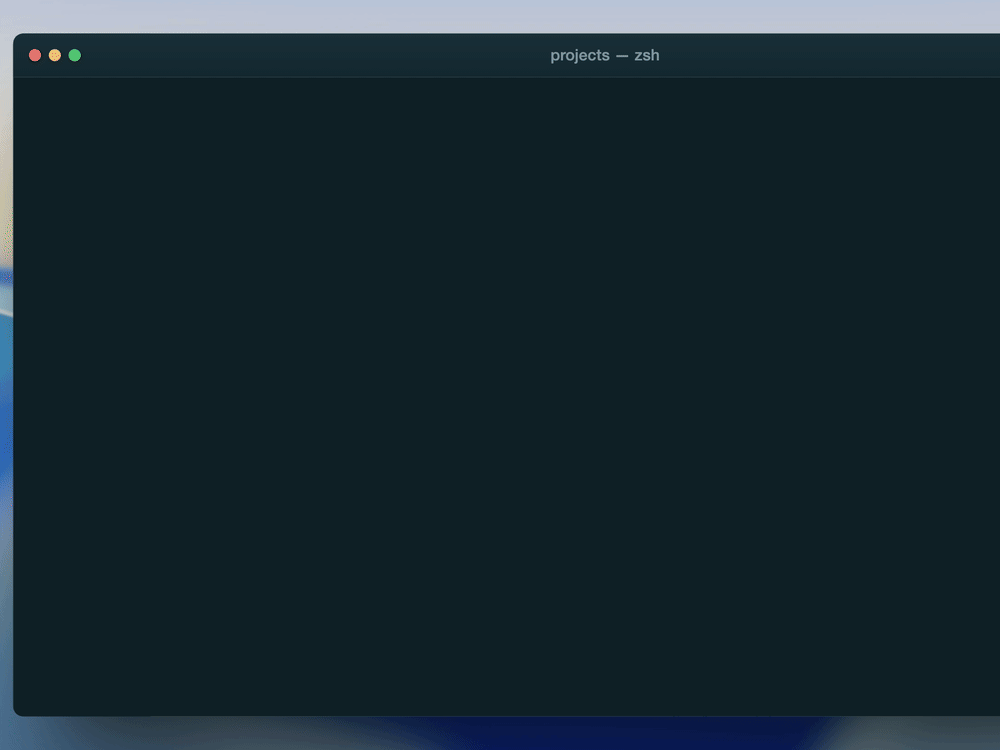
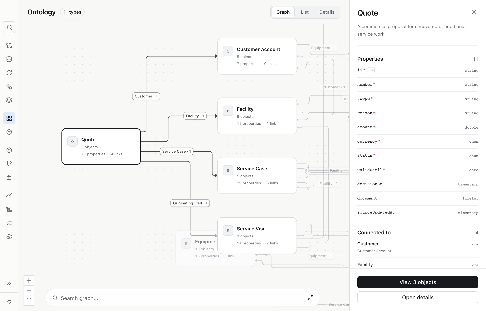
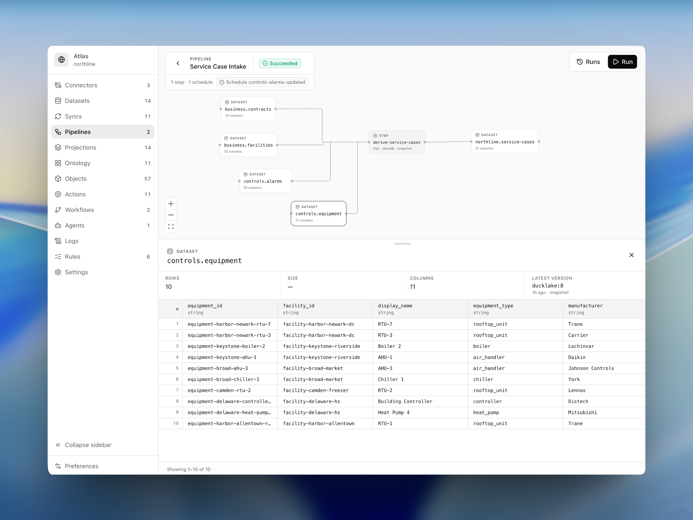
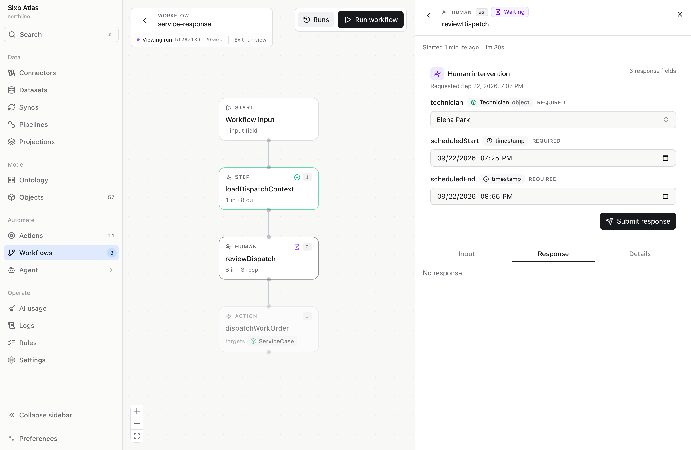

<div align="center">

<picture>
  <source media="(prefers-color-scheme: dark)" srcset="docs/brand/sixb-wordmark-white.svg">
  <source media="(prefers-color-scheme: light)" srcset="docs/brand/sixb-wordmark-black.svg">
  
</picture>

**Build a live model of your operations that teams and AI agents can act on together.**

[Documentation](https://docs.sixb.ai) ·
[Quickstart](#quickstart) ·
[Atlas](#meet-atlas) ·
[Discord](https://discord.gg/rPSbZSRDzQ) ·
[Contributing](https://github.com/sixb-ai/sixb/blob/main/CONTRIBUTING.md)

[](https://www.npmjs.com/package/@sixb/core)
[](https://github.com/sixb-ai/sixb/actions/workflows/ci.yml)
[](https://github.com/sixb-ai/sixb/blob/main/LICENSE)

</div>

## See what you can build

Northline Mechanical is a reference application built with Sixb.

[Open the app](https://northline.sixb.ai) ·
[Explore in Atlas](https://atlas.northline.sixb.ai) ·
[View the API](https://northline.sixb.ai/docs)

<p align="center">
  <picture>
    <source media="(prefers-reduced-motion: reduce)" srcset="docs/brand/northline-dashboard.png">
    
  </picture>
</p>

## What is Sixb?

Sixb is a TypeScript framework that turns operational data into typed objects, relationships, and
actions for apps, people, and AI agents.

With Sixb, you can:

- Build typed operational apps around your own ontology.
- Connect existing systems and respond when their data changes.
- Run actions, workflows, and agents with built-in permissions, approvals, and history.

## Quickstart

You'll need [Bun 1.3 or later](https://bun.sh/docs/installation).

```bash
bun create sixb my-app
cd my-app
bun install
bun run dev
```

The starter runs on SQLite and local files, so no external services are required.

Once it starts:

<table>
  <tr>
    <td>Starter app</td>
    <td><a href="http://localhost:3001">http://localhost:3001</a></td>
  </tr>
  <tr>
    <td>Atlas</td>
    <td><a href="http://localhost:3000">http://localhost:3000</a></td>
  </tr>
  <tr>
    <td>API documentation</td>
    <td><a href="http://localhost:3002/docs">http://localhost:3002/docs</a></td>
  </tr>
</table>

[Follow the complete getting-started guide →](https://docs.sixb.ai/get-started)

## How it works

Model your operations as typed objects and relationships.

```ts
// ontology/invoice.ts
import { defineObjectType, link, prop, stringEnum } from "@sixb/core/ontology"
import { Customer } from "./customer"

export const Invoice = defineObjectType({
  id: "Invoice",
  name: "Invoice",
  properties: [
    prop("id", "string", { required: true, primary: true }),
    prop("amount", "double", { required: true }),
    prop("status", stringEnum(["draft", "sent", "paid"]), { query: { filterable: true } }),
  ],
  links: [link("customer", Customer, { cardinality: "one" })],
})
```

Control how they change with actions.

```ts
// actions/settle-invoice.ts
import { defineAction } from "@sixb/core"
import { Invoice } from "../ontology/invoice"

export const settleInvoice = defineAction("settleInvoice")
  .on(Invoice)
  .params({})
  .edits(({ objects, subject }) => {
    objects(Invoice).byId(subject.primaryId).update({ status: "paid" })
  })
```

Query the same model from your app.

```ts
// app/queries/invoices.ts
import { objects } from "@sixb/client/query"
import { Invoice } from "../../ontology/invoice"

export const sentInvoices = objects(Invoice)
  .query()
  .where((invoice) => invoice.p.status.eq("sent"))
  .expand(Invoice.l.customer)
```

Rules, permissions, workflows, and agents build on the same objects and actions.

## Meet Atlas

Every Sixb project includes Atlas, a built-in workspace for exploring your model and following the
work running through it.

<table>
  <tr>
    <td width="50%" valign="top">
      <br>
      <sub><strong>Browse the model.</strong> See your object types, properties, relationships, and actions in one place.</sub>
    </td>
    <td width="50%" valign="top">
      <br>
      <sub><strong>Trace the data.</strong> Follow datasets through transformations and see how they become operational objects.</sub>
    </td>
  </tr>
  <tr>
    <td colspan="2" valign="top">
      <br>
      <sub><strong>Inspect the work.</strong> Follow every workflow step, including human decisions and controlled actions.</sub>
    </td>
  </tr>
</table>

<sub>Shown with data from the <a href="examples/northline">Northline reference project</a>.</sub>

## Architecture

```text
 External systems                           Apps · Atlas · API clients
   connectors                                   HTTP + WebSocket
        │                                               │
┌───────┴───────────────────────────────────────────────┴─────────────────┐
│ Sixb                                                                    │
│                                                                         │
│ Data       syncs → datasets → pipelines → projections                   │
│ Model      ontology · objects · links · telemetry                       │
│ Control    permissions · rules · actions · workflows · agents           │
│ Execution  schedules · events · orchestrator · workers · run history    │
└────────────────────────────────────┬────────────────────────────────────┘
                                     │
┌────────────────────────────────────┴────────────────────────────────────┐
│ Providers                                                               │
│ operational storage · lake storage · blob storage · broker · queues     │
└─────────────────────────────────────────────────────────────────────────┘
```

Locally, `sixb dev` runs everything together. In production, the API and background roles can run
independently against the same durable providers.

<details>
<summary><strong>Provider options</strong></summary>

| Slot | Implementations |
| --- | --- |
| `storage` | SQLite · PostgreSQL |
| `lakeStorage` | Local files · DuckLake |
| `blobStorage` | Local files · S3-compatible |
| `broker` | In-memory · Redis · NATS |
| `queues` | In-memory · BullMQ |
| `sandboxes` *(optional)* | Local · Apple Container · smolVM · Vercel |

</details>

<details>
<summary><strong>Repository map</strong></summary>

| Path | Contains |
| --- | --- |
| `packages/` | Runtime, server, CLI, Atlas, client, UI, and workers |
| `storage/`, `broker/`, `queues/`, `sandboxes/`, `auth/` | Infrastructure providers |
| `connectors/` | First-party integrations |
| `examples/` | Runnable reference projects |
| `docs/` | Source for [docs.sixb.ai](https://docs.sixb.ai) |

</details>

## Learn more

- **Start:** [Getting started](https://docs.sixb.ai/get-started) ·
  [Project structure](https://docs.sixb.ai/fundamentals/project-structure)
- **Core:** [Ontology](https://docs.sixb.ai/ontology) ·
  [Objects](https://docs.sixb.ai/objects) · [Actions](https://docs.sixb.ai/actions) ·
  [Workflows](https://docs.sixb.ai/workflows) · [Agents](https://docs.sixb.ai/agents)
- **Build:** [Data](https://docs.sixb.ai/data) · [Apps](https://docs.sixb.ai/apps) ·
  [Server & API](https://docs.sixb.ai/server)
- **Operate:** [Infrastructure](https://docs.sixb.ai/infrastructure) ·
  [Deployment](https://docs.sixb.ai/deployment)
- **Explore:** [Examples](https://docs.sixb.ai/examples) ·
  [Northline Mechanical](examples/northline)

## Status

Sixb is currently `0.1.0`, the first minimally stable and tested release promoted to npm's
`latest` tag. APIs may change between minor releases, and database upgrades may require manual
migration before 1.0. See the [changelog](CHANGELOG.md) for compatibility notes.

## Contributing

Contributions are welcome. See [CONTRIBUTING.md](CONTRIBUTING.md) for the development and review
workflow.

## License

[MIT](LICENSE)
