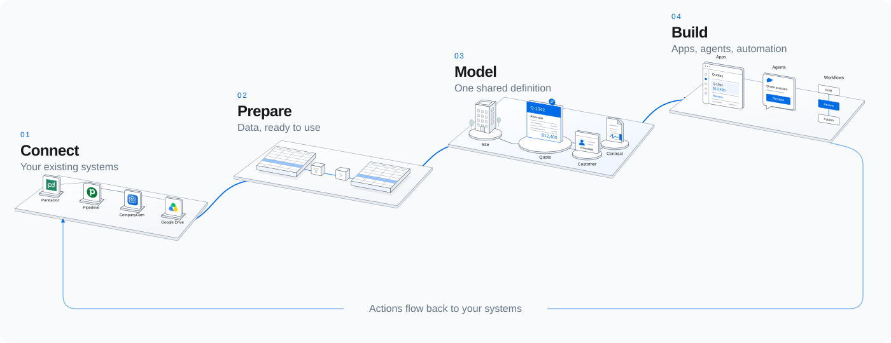
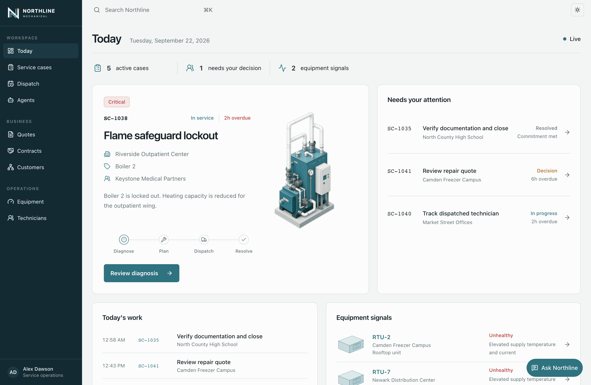

<picture>
  <source media="(prefers-color-scheme: dark)" srcset="docs/brand/sixb-wordmark-white.svg">
  <source media="(prefers-color-scheme: light)" srcset="docs/brand/sixb-wordmark-black.svg">
  
</picture>

# Model your domain. Put it to work.

A TypeScript framework for ontology-powered apps and AI.

Connect your data, define how it relates and changes, and build apps and AI that work with the same model.

[Documentation](https://docs.sixb.ai) · [Get started](#quickstart) · [Discord](https://discord.gg/rPSbZSRDzQ)

<a href="https://docs.sixb.ai">
  <picture>
    <source media="(prefers-color-scheme: dark)" srcset="docs/brand/architecture-dark.svg">
    
  </picture>
</a>

## Quickstart

With [Bun 1.4.2 or later](https://bun.sh/docs/installation):

```bash
bun create sixb my-app
cd my-app
bun install
bun run dev
```

No database setup or API keys required. Open your [app](http://localhost:3001),
[Atlas](http://localhost:3000), or the [API docs](http://localhost:3002/docs).

[Getting started →](https://docs.sixb.ai/get-started)

## One model, shared everywhere

Define your domain in TypeScript. Sixb provides the API, typed queries, and permissions around it.

```ts
// ontology/quote.ts
import { defineObjectType, prop, stringEnum } from "@sixb/core/ontology"

export const Quote = defineObjectType({
  id: "Quote",
  name: "Quote",
  properties: [
    prop("id", "string", { required: true, primary: true }),
    prop("totalCents", "integer", { required: true }),
    prop("status", stringEnum(["draft", "approved", "sent"]), {
      required: true,
      query: { searchable: true, filterable: true },
    }),
  ],
})
```

Use that same definition to query from your app, with types carried through to the result.

```ts
// app/queries/quotes.ts
import { objects } from "@sixb/client/query"
import { Quote } from "../../ontology/quote"

export function listApprovedQuotes() {
  return objects(Quote)
    .query()
    .where((quote) => quote.p.status.eq("approved"))
    .list()
}
```

[Apps](https://docs.sixb.ai/apps) and [workflows](https://docs.sixb.ai/workflows) share the model and
its [actions](https://docs.sixb.ai/actions), with [permissions](https://docs.sixb.ai/auth/authorization)
enforced by the runtime.

The built-in [AI agent](https://docs.sixb.ai/models) works with that same model through the Sixb CLI
in a sandbox. Choose the models it can use. In chat, it inherits the user's permissions; in a
workflow, you choose its access.

## Meet Atlas

Atlas comes with Sixb. Explore your model, inspect its data, and follow what runs through it.

<picture>
  <source media="(prefers-color-scheme: dark)" srcset="docs/brand/atlas-ontology-dark.png">
  
</picture>

**Explore the model.** See how your types connect, then inspect their properties, relationships, and actions.

<details>
<summary>View a workflow run</summary>

<picture>
  <source media="(prefers-color-scheme: dark)" srcset="docs/brand/atlas-workflow-dark.png">
  
</picture>

**Follow the work.** Inspect a workflow run from its input through human review and execution.

</details>

## Built with Sixb

[Northline Mechanical](examples/northline) is a reference app for a fictional building-services company.
Its interface, assistant, and automation work with the same model of customers, equipment, and service cases.

<a href="https://northline.sixb.ai">
  <picture>
    <source media="(prefers-color-scheme: dark)" srcset="docs/brand/northline-dashboard-dark.png">
    
  </picture>
</a>

[Open app](https://northline.sixb.ai) · [Explore Atlas](https://atlas.northline.sixb.ai) ·
[API docs](https://northline.sixb.ai/docs) · [Source](examples/northline)

## Explore further

[Documentation](https://docs.sixb.ai) · [Examples](https://docs.sixb.ai/examples) ·
[CLI reference](https://docs.sixb.ai/cli) · [Contributing](CONTRIBUTING.md)

Sixb is in active development. Releases on the `0.1.x` line can include breaking changes and database
migrations. Review the [changelog](CHANGELOG.md) before upgrading.

[](https://www.npmjs.com/package/@sixb/core)
[](https://github.com/sixb-ai/sixb/actions/workflows/ci.yml)

[MIT License](LICENSE)
